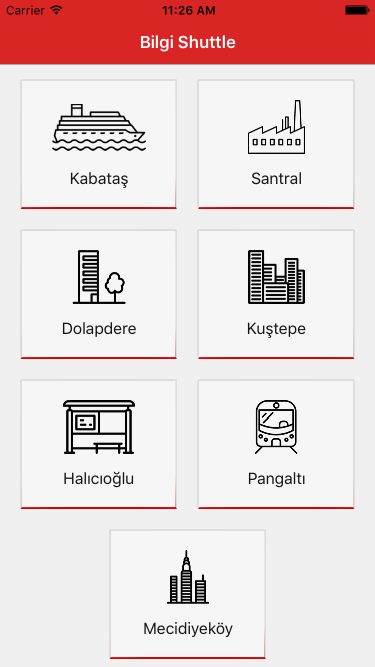
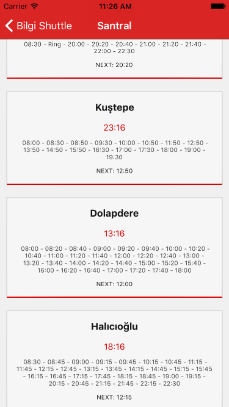

#Bilgi Shuttle iOS Application

Basic but useful iOS application for listing the shuttle routes and times of İstanbul Bilgi University, built with [React Native](https://facebook.github.io/react-native/).

The data comes from [bilgi-shuttle-api](https://github.com/mdegis/bilgi-shuttle/), processed and shown in this application.

There is also a web version of this app: [bilgi-shuttle-webapp](https://github.com/zebrasinpyjamas/bilgi-shuttle-webapp)

##Installation
```bash
# Install node & npm (or update if you have an older version)
https://nodejs.org/

# Clone the repository
$ git clone https://github.com/zebrasinpyjamas/bilgi-shuttle-ios.git

# Go to app folder
$ cd bilgi-shuttle-ios/BilgiShuttle

# Run npm install
$ npm install
```

##Usage
```bash

Note that bilgi-shuttle-api should be running at the same time with this app to get shuttle data.

Open 'BilgiShuttle/ios/BilgiShuttle.xcodeproj' file in XCode, then run iOS simulator.
On iOS shake the device or press control + ⌘ + z in the simulator. 
Then enable live reload from developer menu.

Main file is 'BilgiShuttle/index.ios.js' and the components are inside 'App' folder.
```

##Screenshots





##License

	Copyright [2016] [Altay Aydemir]

    Licensed under the Apache License, Version 2.0 (the "License");
    you may not use this file except in compliance with the License.
    You may obtain a copy of the License at

      http://www.apache.org/licenses/LICENSE-2.0

    Unless required by applicable law or agreed to in writing, software
    distributed under the License is distributed on an "AS IS" BASIS,
    WITHOUT WARRANTIES OR CONDITIONS OF ANY KIND, either express or implied.
    See the License for the specific language governing permissions and
    limitations under the License.